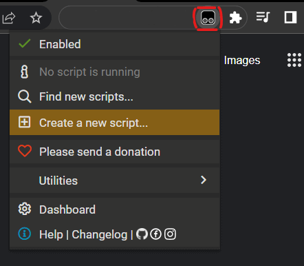

  
#  UserScripts-Corp

Collection of UserScripts for browser's plugins like TamperMonkey.

## Script list

- [Aws-Mfa-Authenticator](./Scripts/Aws-Mfa-Authenticator/README.md)
- [Aws-CloudWatch-LogLens](./Scripts/Aws-CloudWatch-LogLens/README.md)

## How to install UserScripts

Install the [browser addon TamperMonkey](https://www.tampermonkey.net/ ) (for
[Chrome](https://chrome.google.com/webstore/detail/tampermonkey/dhdgffkkebhmkfjojejmpbldmpobfkfo?hl=en ),
[Firefox](https://addons.mozilla.org/en-US/firefox/addon/tampermonkey/ ),
[Edge](https://microsoftedge.microsoft.com/addons/detail/tampermonkey/iikmkjmpaadaobahmlepeloendndfphd ),
[Safari](https://apps.apple.com/app/apple-store/id1482490089?pt=117945903&ct=tm.net&mt=8 ),
[Opera](https://addons.opera.com/en/extensions/details/tampermonkey-beta/ ), etc).  

To add a new script, click on the addon icon > "Create a new script...":  
  

This will open a new window with TamperMonkey's editor.
Just paste the whole JavaScript code replacing all the original text template.  
Save the script in the editor with `Control + S`.  

You can also debug the script using the regular browser DevTools with it's console window.  

