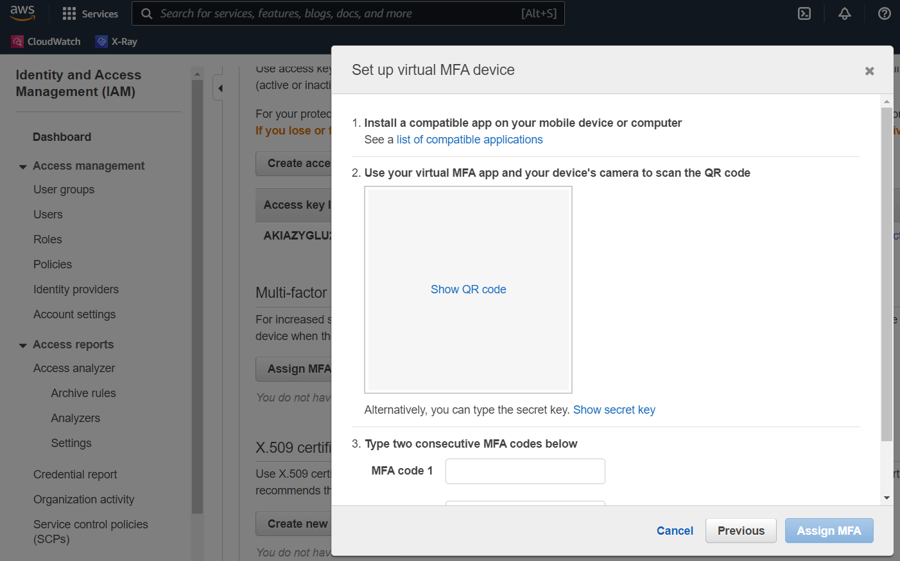

# UserScript: Aws-Mfa-Authenticator


## Description

Automate the AWS web console login by auto-filling the MFA token during login. 


## How to install

Install the script [Aws-Mfa-Authenticator.js](./src/Aws-Mfa-Authenticator.js) 
following the general installation steps [here](../../README.md#How-to-install-UserScripts).  


From the [AWS-console](https://aws.amazon.com/console),  
assign a device as MFA token generator by going to top right corner menu clicking on your user-name:  
'Security Credentials' > 'Multi-factor authentication (MFA)' > 'Assign MFA device':  
- In the `Device name` field type your username/email.  
- Select `Authenticator app`.  
- Click on `Next`.  
- Click on `Show secret key` to show the 64 alpha-numeric secret key.
- Copy the secret key to the clipboard.  

  

 - Finally paste your secret-code into the user-script replacing the line:
```js
mfaSecret: "PASTE_YOUR_MFA_SECRET_HERE"
```
- Press `Control + S` to save the changes and close the script editor.  

